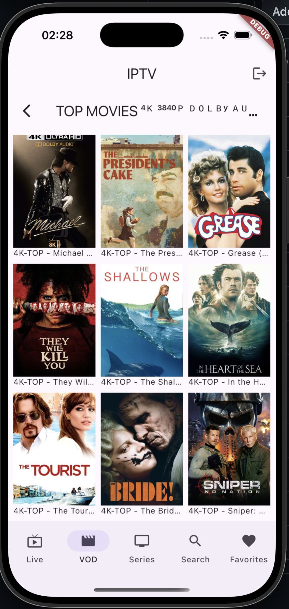

# 📺 Xtream IPTV Flutter Client

A premium, iOS-first, open-source generic IPTV client built with Flutter, designed to authenticate against Xtream Codes / Xtream-compatible panels. 

This app is not a content source and doesn't bundle, host, or resell any streams. It simply provides a blazing-fast, robust player interface for your own provider's credentials.




---

## ✨ Features

- **Multi-Profile Support:** Save multiple provider profiles securely and switch between them instantly.
- **Live TV & EPG:** Watch live channels with a "Now/Next" EPG strip.
- **VOD & Series:** Browse movies and TV shows, complete with season and episode tracking.
- **Universal Search:** Quickly find channels, VODs, and series across your provider's entire catalog.
- **Favorites:** Keep your most-watched content a tap away.
- **Advanced Playback:**
  - **Primary Engine:** `video_player` (AVPlayer) with full **AirPlay**, **Background Audio**, and **Picture-in-Picture (PiP)** support for HLS streams (`.m3u8`).
  - **Fallback Engine:** `media_kit` (mpv-backed) to flawlessly handle raw MPEG-TS (`.ts`) streams when panels don't support HLS.

## 🏗️ Architecture & Stack

Built for scale, maintainability, and testing using strict **Clean Architecture**:
`Presentation → Domain ← Data`

- **State Management:** `flutter_bloc` (Cubits for UI state, Blocs for event streams like search debounce)
- **Dependency Injection:** `get_it` (Service Locator)
- **Routing:** `go_router` (with reactive auth guards)
- **Functional Error Handling:** `fpdart` (`TaskEither` & `Either` to never throw unhandled exceptions)
- **Networking:** `xtream_code_client` for Xtream API parsing + `dio` for raw HTTP tasks (like EPG and HLS probing)
- **Security:** `flutter_secure_storage` to keep provider credentials safe in the native Keychain.

## 🚀 Getting Started

### Prerequisites
- Flutter SDK (latest stable)
- Xcode (for iOS deployment)
- A valid Xtream Codes provider URL, username, and password.

### Installation

1. Clone the repository:
   ```bash
   git clone https://github.com/tieorange/iptv-flutter-xtream.git
   cd iptv-flutter-xtream
   ```

2. Install dependencies:
   ```bash
   flutter pub get
   ```

3. Run the app:
   ```bash
   flutter run
   ```
   > **Note:** For iOS, you can also use `make run-ios` if you want to quickly deploy to the simulator. Testing AirPlay requires a physical device.

## 📁 Project Structure

```text
lib/
├── core/             # Shared infrastructure (DI, Router, Network, Errors, Storage)
├── features/
│   ├── auth/         # Profile management and login
│   ├── live_tv/      # Live channels and categories
│   ├── vod/          # Movies and VOD content
│   ├── series/       # TV shows, seasons, and episodes
│   ├── player/       # Dual-engine playback (AVPlayer + mpv)
│   ├── epg/          # Electronic Program Guide (Now/Next)
│   ├── search/       # Universal search across all content
│   └── favorites/    # User's saved favorites
└── main.dart         # Entry point and DI initialization
```

## 🛡️ Security & Privacy
This application handles sensitive provider credentials. 
- Passwords are **never** logged to the console.
- Sensitive URLs and query parameters are dynamically scrubbed from crash reports and network logs.
- All credentials are encrypted using the device's native secure keystore (`Keychain` on iOS, `EncryptedSharedPreferences` on Android).

## 📄 License
This project is licensed under the MIT License - see the LICENSE file for details.
